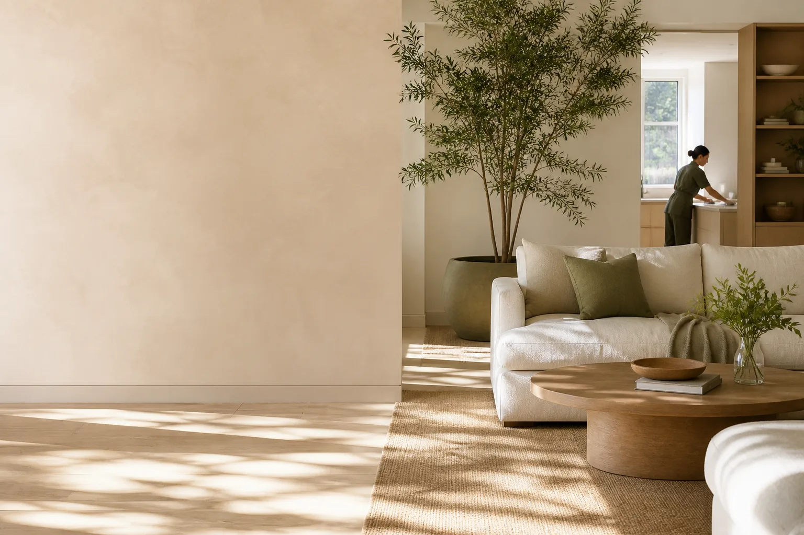

# Zen Cleaning

Choosing a cleaning service often means comparing vague service lists, judging trust from a single page, and filling out a quote form before knowing what to expect. Zen explores a clearer first step: a calm, accessible page that helps a visitor understand the service, choose what they need, and preview an estimate without sending personal data.

It is a responsive, art-directed landing page concept for a modern home and office cleaning service. The project uses editorial typography, layered botanical imagery, service cards, trust-focused storytelling, and an accessible estimate-request flow to make that decision easier.



## Highlights

- Responsive compositions for portrait phones, landscape phones, tablets, laptops, desktop, and ultrawide screens
- Semantic page structure and accessible navigation, dialog, form labels, focus states, and reduced-motion behavior
- Optimized WebP imagery with lazy loading below the fold
- Interactive service selection and estimate-request preview with no back end or data collection
- Social sharing metadata and a relative-asset setup suitable for GitHub Pages

## Run locally

No build step or package installation is required.

```bash
python3 dev_server.py
```

Then open [http://localhost:8000](http://localhost:8000).

## Run browser tests

The static preview needs only Python 3. The test suite additionally requires Node.js 20 or newer, npm, and Google Chrome.

From the repository root:

```bash
npm ci
npm test
```

[playwright.config.js](playwright.config.js) selects the `chrome` channel, so installing only Playwright's default Chromium browser does not satisfy this configuration. Ensure Google Chrome is installed before running the suite.

Playwright starts `python3 dev_server.py` automatically at `http://127.0.0.1:8000`. It reuses a server already running there, so stop any unrelated service on port 8000 before testing.

[tests/site.spec.js](tests/site.spec.js) covers ten viewport sizes, horizontal overflow, mobile navigation's Escape/focus behavior, estimate-request completion, and reduced-motion visibility. Failure screenshots are enabled in the Playwright configuration.

## Deploy

The site is deployment-ready as static files. Enable GitHub Pages for the repository's `main` branch/root directory, or deploy the folder to any static host.

## Project structure

```text
.
├── index.html          # Semantic page content and metadata
├── assets/
│   ├── styles.css      # Responsive art direction and component styles
│   ├── site.js         # Navigation, dialog, form, and reveal behavior
│   └── *.webp          # Optimized visual assets
└── dev_server.py       # Lightweight local preview server
```

## Scope

This is a front-end portfolio concept, not a live cleaning business. The estimate form intentionally demonstrates validation and success states without transmitting or storing personal data. Connect the form handler to a real booking service before using it in production.

## License

Original contributions by Malik Abuallatta are licensed under the
[MIT License](LICENSE). Third-party code, adaptations, dependencies, and assets
retain their existing licenses and notices. This license does not grant new
rights to third-party material.
